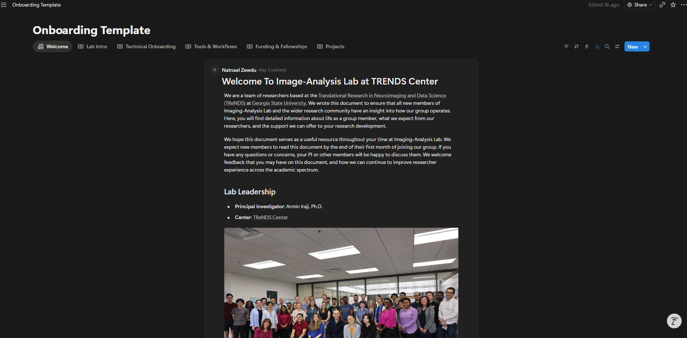
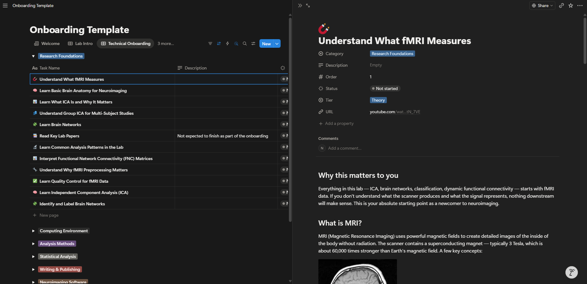
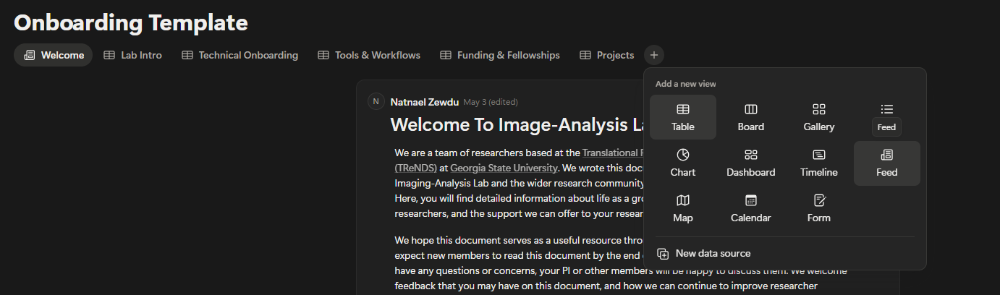
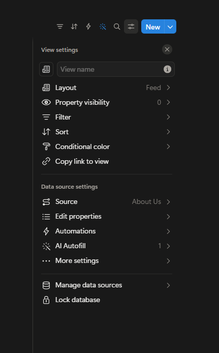
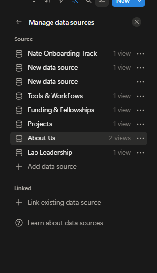
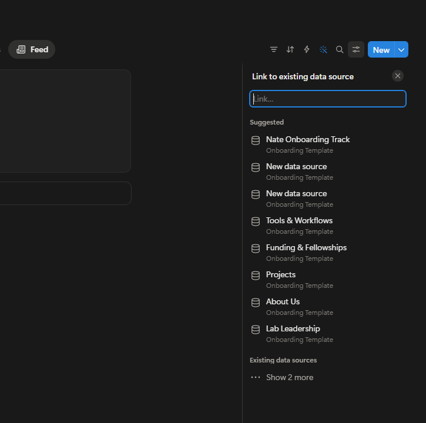

# Notion Onboarding: Imaging-Analysis Lab

Programmatically manages onboarding content in Notion for the **Imaging-Analysis Lab (TReNDS Center, GSU)**.

All task content lives in plain Markdown files. A single command syncs everything to Notion. No Python editing required to add, edit, or remove tasks.

---

## What you are building



The Notion workspace is an **Onboarding Template** with a row of **tabs** across the top. Each tab is a separate section of the onboarding experience. The **Welcome** and **Lab Leadership** tabs use a Feed-view database where each entry is a document-style page. The remaining tabs (Lab Intro, Technical Onboarding, Tools & Workflows, Funding & Fellowships, Projects) use a Table-view database where each row is a structured task.

---



This is what a **database tab** looks like. There are four concepts to understand:

**Tab** - One of the top-level sections (e.g. Technical Onboarding). Each tab maps to one folder under `content/` in this repo. The connection between the folder and its Notion database is defined in the `_tab.yaml` file (for Table tabs) or `_page.yaml` file (for Feed tabs) inside that folder.

**Category** - The coloured group headers inside a tab (e.g. Research Foundations, Computing Environment, Analysis Methods). Each category is a subfolder inside the tab folder, e.g. `content/technical_onboarding/Research Foundations/`. The subfolder name is the category name - rename the folder and the category updates in Notion automatically on the next sync.

**Task** - Each row in the database (e.g. "Understand What fMRI Measures"). Each task maps to one `.md` file inside the category subfolder. The file's YAML frontmatter (the `---` block at the top) sets the task name, emoji, tier, order, and URL. The body of the file becomes the task's page content.

**Page** - Clicking a task row opens its full page (shown on the right). This is where the detailed content lives - headings, explanations, bullet points, links, and images. Everything you write in the `.md` file body appears here.

---

## Table of Contents

- [How it works](#how-it-works)
- [Repository structure](#repository-structure)
- [Setup](#setup)
- [Everyday workflows](#everyday-workflows)
  - [Add a new task](#add-a-new-task)
  - [Edit an existing task](#edit-an-existing-task)
  - [Delete a task](#delete-a-task)
  - [Sync to Notion](#sync-to-notion)
  - [Pull content from Notion](#pull-content-from-notion)
- [Frontmatter reference](#frontmatter-reference)
- [For AI agents](#for-ai-agents)
- [Environment variables](#environment-variables)

---

## How it works

Each Notion tab corresponds to a folder under `content/`:

| Notion tab           | Local folder                        | Env var                      |
|----------------------|-------------------------------------|------------------------------|
| Welcome              | `content/welcome/`                  | `WELCOME_PAGE_ID`            |
| Lab Leadership       | `content/lab_leadership/`           | `LAB_LEADERSHIP_PAGE_ID`     |
| Lab Intro            | `content/lab_intro/`                | `HANDBOOK_DATA_SOURCE_ID`    |
| Technical Onboarding | `content/technical_onboarding/`     | `TECHNICAL_DATA_SOURCE_ID`   |
| Tools & Workflows    | `content/tools/`                    | `TOOLS_DATA_SOURCE_ID`       |
| Funding & Fellowships| `content/funding/`                  | `FUNDING_DATA_SOURCE_ID`     |
| Projects             | `content/projects/`                 | `PROJECTS_DATA_SOURCE_ID`    |

Every `.md` file with a YAML frontmatter block (see the [Frontmatter reference](#frontmatter-reference) section) is treated as one Notion task page. Files without frontmatter are ignored by the sync script.

**What is frontmatter?**
Frontmatter is a short block of structured metadata at the very top of a Markdown file, fenced by `---` lines. It tells `sync.py` how to create the Notion page (title, icon, ordering, etc.) without mixing that information into the readable content below. If you have used Jekyll, Hugo, or any static site generator you have seen this pattern before. See the [official YAML spec](https://yaml.org/spec/1.2.2/) if you want to learn more about the format used inside the `---` block.

```markdown
---
task_name: "Understand What fMRI Measures"
emoji: "🧲"
tier: Theory
order: 1
url: "https://example.com"
---

## Body content starts here...
```

---

## Repository structure

```
.env.example                   <- copy to .env and fill in your tokens
sync.py                        <- THE entry point - syncs .md files to Notion
pull_notion.py                 <- pull Notion content back to .md files
config.py                      <- loads env vars (do not edit)
notion_api.py                  <- Notion API helpers (do not edit)
requirements.txt

content/
  welcome/                     <- Welcome tab (Feed view)
    _page.yaml                 <- page config: label + notion_env_var
    welcome.md                 <- full page content
  lab_leadership/              <- Lab Leadership tab (Feed view)
    _page.yaml
    lab_leadership.md
  lab_intro/                   <- Lab Intro tab (Table view)
    _tab.yaml                  <- tab config: label + notion_env_var
    Lab Culture & Conduct/     <- category subfolder
      read_lab_handbook.md
      ...
  technical_onboarding/        <- Technical Onboarding tab (Table view)
    _tab.yaml
    Research Foundations/
    Computing Environment/
    ...
  tools/                       <- Tools & Workflows tab (Table view)
    _tab.yaml
    ...
  funding/                     <- Funding & Fellowships tab (Table view)
    _tab.yaml
    ...
  projects/                    <- Projects tab (Table view)
    _tab.yaml
    ...

data/                          <- Raw source files (Word docs, spreadsheets, photos)
assets/                        <- Screenshots used in this README
```

---

## Setup

### 1. Clone the repo

```bash
git clone https://github.com/<org>/notion-onboarding.git
cd notion-onboarding
```

### 2. Create a virtual environment

```bash
python -m venv .venv
# macOS / Linux
source .venv/bin/activate
# Windows
.venv\Scripts\activate
```

### 3. Install dependencies

```bash
pip install -r requirements.txt
```

### 4. Set up environment variables

Copy `.env.example` to `.env` and fill in each value:

```bash
cp .env.example .env
```

> **Where to get the values:**
> All tokens and IDs are stored in the **Environment Variables** spreadsheet
> inside the Onboarding Resources folder on SharePoint.
>
> [Request access to Onboarding Resources](https://studentgsu-my.sharepoint.com/:f:/r/personal/nalemayehu3_student_gsu_edu/Documents/Onboarding%20Resources?csf=1&web=1&e=dvr9zc)
>
> You must be added to the folder by someone who already has edit access before
> you can view the spreadsheet. Once you have access, open the
> **Environment Variables** file and copy each value into your `.env`.

---

## Everyday workflows

The **`.md` file is the source of truth**. Edit the file, run `sync.py`, and Notion reflects the change. The sync **reconciles by default** - it compares local files against Notion and:

- Creates pages that exist locally but not in Notion
- Archives pages that exist in Notion but no longer have a local file
- Skips pages that already exist with the same `task_name` (use `--delete` to force-update body content)

### Add a new task

1. Create a new `.md` file in the appropriate `content/<tab>/<category>/` folder.  
   Name it descriptively: `understand_bold_signal.md` (no number prefix needed).

2. Add YAML frontmatter at the top (see [Frontmatter reference](#frontmatter-reference) for all keys):

   ```markdown
   ---
   task_name: "Understand the BOLD Signal"
   emoji: "🧲"
   tier: Theory
   order: 13
   url: "https://example.com/resource"
   ---

   ## Why this matters
   Write the task body here in standard Markdown...
   ```

3. Run `python sync.py` (or `--tab <folder>`). The new page is created in Notion.

### Edit an existing task

**Body content changed** (the Markdown below the frontmatter):

Notion's API does not support in-place block updates - the page must be
archived and recreated. Run:

```bash
python sync.py --tab <folder> --delete
```

**Frontmatter only changed** (task name, emoji, category, tier, order, url):

Same as above - use `--delete` to wipe the old page and recreate it with the
updated metadata.

> **Tip:** `--delete` only affects the one tab you specify. Other tabs are untouched.

### Delete a task

1. Delete the `.md` file (or rename it without a `task_name` frontmatter key).
2. Run `python sync.py` - the sync automatically detects the removed file and
   archives the corresponding Notion page.

### Move a task to a different category

1. Move the `.md` file to `content/<tab>/<NewCategory>/` (create the folder if needed).
2. Run `python sync.py --tab <folder> --delete` to re-publish with the new category.

### Rename a task

1. Update `task_name` in the frontmatter.
2. Run `python sync.py --tab <folder> --delete` - the old-named page is archived
   and the renamed page is created.

### Rename a category subfolder

The **subfolder name is the category** - `sync.py` derives the Notion
`Category` property directly from the parent folder name, ignoring any
`category:` key in the frontmatter.  Renaming a folder is all you need.

1. Rename the subfolder (e.g. `Fellowships/` → `Grants and Fellowships/`).
2. Run `python sync.py --tab <folder> --delete` - old pages archived, new ones
   created with the updated category name.

No file edits required.

### Rename a tab folder

Tab folders are discovered dynamically via the `_tab.yaml` inside them, so
renaming a tab folder requires **no code changes**.

1. Rename the folder (e.g. `funding/` → `money/`).
2. That's it. The `_tab.yaml` inside still points to the correct
   `notion_env_var`. Run `python sync.py --tab money` as normal.

> To change the **display label** shown in terminal output, edit the `label:`
> field in `content/<tab>/_tab.yaml` (Table tabs) or `_page.yaml` (Feed tabs).
> This does not affect Notion.

### Add a new Notion tab or page

Every tab and page in Notion is backed by a **data source**. You must create the
data source first, then attach a view to it. There are two view types used in
this template:

- **Table view** - for database tabs (Lab Intro, Technical Onboarding, etc.). Each row is a task.
- **Feed view** - for plain page tabs (Welcome, Lab Leadership). Each entry is a document-style page.

#### Step 1 - Create a new data source in Notion

Click the `+` button at the end of the tab bar. In the "Add a new view" picker,
click **New data source** at the bottom.



Choose **Table** if you are creating a new task database tab, or **Feed** if you
are creating a new document-style page. Notion will create a new data source and
open it. Name the data source (this becomes the tab label in Notion).

#### Step 2 - Find the data source ID

Click the view settings icon (the sliders icon, top right) to open the view
settings panel. Under **Data source settings**, click **Manage data sources**.



You will see a list of all data sources in the workspace. Your new one will
appear here. Copy its name - you will need it to find the ID in the next step.



To get the ID you need, it depends on the view type:

- **Table tab** - The UUID before `?v=` in the URL is your data source ID. Add it to `.env` and `config.py` as `MY_TAB_DATA_SOURCE_ID`.

- **Feed tab (plain page)** - The UUID before `?v=` is the **database** ID, which you do not need. You need the **page entry** ID instead. Create one entry inside the Feed, double-click it to open it fully, then copy the UUID after `&p=` in the URL. Add that to `.env` and `config.py` as `MY_PAGE_ID`.

#### Step 3 - Link to an existing data source (if connecting later)

If you created the data source separately and want to attach a view to it, click
**Manage data sources** then **Link existing data source**. Search for your data
source by name and select it.



#### Step 4 - Wire it up in the repo

**For a Table tab (task database):**

1. Create `content/<folder>/` with a `_tab.yaml`:
   ```yaml
   label: "My New Tab"
   notion_env_var: MY_NEW_TAB_DATA_SOURCE_ID
   ```
2. Add `MY_NEW_TAB_DATA_SOURCE_ID` to `.env` and `config.py`.
3. Create category subfolders and `.md` files with frontmatter.
4. Run `python sync.py --tab <folder>`.

**For a Feed tab (plain page):**

1. Create `content/<folder>/` with a `_page.yaml`:
   ```yaml
   label: "My New Page"
   notion_env_var: MY_NEW_PAGE_ID
   ```
2. Add `MY_NEW_PAGE_ID` to `.env` and `config.py`.
3. Create a `.md` file with the page content.
4. Run `python sync.py --tab <folder>`.

> **Note for Feed tabs:** The data source ID in the URL is the database ID, not
> the page ID. For Feed-style pages, you also need the ID of the individual entry
> inside the database (the `&p=` UUID from the URL when you open an entry).
> See the `WELCOME_PAGE_ID` instructions in the [Environment variables](#environment-variables)
> section for details.

### Edit a Welcome or Lab Leadership page (Feed-view tabs)

Welcome and Lab Leadership use a Feed-view database where each entry is a
document-style page. Editing always does a full wipe + rewrite because there
are no named rows to reconcile against.

1. Edit the `.md` file in the corresponding `content/` folder.
2. Run `python sync.py --tab <folder>` (e.g. `--tab welcome` or `--tab lab_leadership`).

### Sync to Notion

```bash
# Sync everything (plain pages + all database tabs)
python sync.py

# Sync one tab or page by folder name
python sync.py --tab technical_onboarding
python sync.py --tab welcome

# Preview without touching Notion
python sync.py --dry-run

# Full wipe + re-sync a database tab (required after editing body content)
python sync.py --tab lab_intro --delete

# Show local inventory
python sync.py --status
```

### Pull content from Notion

If someone edited task body content directly in Notion and you want to sync
those changes back to the local `.md` files:

```bash
python pull_notion.py                              # pull all tabs
python pull_notion.py --tab technical_onboarding  # pull one tab
python pull_notion.py --dry-run                    # preview only
```

> For Feed tabs (Welcome, Lab Leadership), the pull script overwrites the entire
> `.md` file since those pages have no frontmatter to preserve.

## Frontmatter reference

| Key         | Required | Description                                           |
|-------------|----------|---------------------------------------------------------|
| `task_name` | **Yes**  | Exact title shown in Notion                           |
| `emoji`     | No       | Page icon (default: `📌`)                             |
| `tier`      | No       | `Theory` or `Hands-On`                                |
| `order`     | No       | Integer, controls sort order within a category        |
| `url`       | No       | Reference link shown in Notion                        |

> **Category is set by the folder name**, not a frontmatter key. Place the file
> in `content/<tab>/<Category Name>/` and sync. No `category:` key needed.

Files without a `task_name` key are silently skipped by `sync.py` and
`pull_notion.py`. This lets you keep notes or archived content in the same
folder without accidentally publishing them.

---

## For AI agents

This repo is structured to be easily operated by AI coding agents. Key facts:

- **Single entry point:** `python sync.py [options]` - no other scripts needed for CRUD.
- **Data lives in `.md` files:** All task content and metadata is in `content/<tab>/<category>/*.md`. Agents should read/write these files.
- **Tab config in `_tab.yaml` / `_page.yaml`:** Table-view tabs use `_tab.yaml`; Feed-view tabs (Welcome, Lab Leadership) use `_page.yaml`. Both are discovered dynamically - no hardcoded lists in Python.
- **Frontmatter drives Notion:** Change the frontmatter to change how a task appears in Notion. Change the body to change the task's page content.
- **Reconciles by default:** Running `sync.py` creates new pages and archives removed ones automatically.
- **`--delete` for edits:** Body content edits require `--delete` on the tab (Notion API limitation).
- **Tab mapping:** see the table in [How it works](#how-it-works).
- **No Python editing needed** for ordinary CRUD - only `.md` files.

Suggested agent workflow for a content change:
1. Read the relevant `.md` file(s) in `content/<tab>/<category>/`.
2. Modify frontmatter and/or body as needed.
3. Run `python sync.py --dry-run` to verify the change looks correct.
4. Run `python sync.py --tab <tab>` for adds/deletes (auto-reconciles).
5. Run `python sync.py --tab <tab> --delete` if body content was edited.

---

## Environment variables

| Variable                    | Description                                          |
|-----------------------------|------------------------------------------------------|
| `NOTION_TOKEN`              | **Notion Internal Integration Token** (secret)       |
| `HANDBOOK_DATA_SOURCE_ID`   | Notion database ID for the Lab Intro tab             |
| `TECHNICAL_DATA_SOURCE_ID`  | Notion database ID for the Technical Onboarding tab  |
| `TOOLS_DATA_SOURCE_ID`      | Notion database ID for the Tools & Workflows tab     |
| `FUNDING_DATA_SOURCE_ID`    | Notion database ID for the Funding & Fellowships tab |
| `PROJECTS_DATA_SOURCE_ID`   | Notion database ID for the Projects tab              |
| `WELCOME_PAGE_ID`           | Page entry ID for the Welcome Feed tab               |
| `LAB_LEADERSHIP_PAGE_ID`    | Page entry ID for the Lab Leadership Feed tab        |

> Store these in a `.env` file at the repo root. The `.env` file is gitignored
> and must **never** be committed.

### How to find each ID

All values are stored in the **Environment Variables** spreadsheet in the
[Onboarding Resources](https://studentgsu-my.sharepoint.com/:f:/r/personal/nalemayehu3_student_gsu_edu/Documents/Onboarding%20Resources?csf=1&web=1&e=dvr9zc)
SharePoint folder. Request access from someone with edit permissions if you
do not have it yet.

**`WELCOME_PAGE_ID` and `LAB_LEADERSHIP_PAGE_ID` - if setting up a fresh workspace:**
The values in the spreadsheet are for this lab's Notion workspace. If you are
configuring a different workspace, find these IDs yourself:

1. Click the relevant tab (Welcome or Lab Leadership) in Notion.
2. **Double-click** the entry inside to open it as a full page.
3. Copy the UUID after `&p=` in the URL:
   ```
   notion.so/...?v=...&p=3550d69bb5ad80ccabb5f1f9feca76c7&pm=c
                          ^^^^^^^^^^^^^^^^^^^^^^^^^^^^^^^^
   ```
4. Add it to `.env`: `WELCOME_PAGE_ID=<that-uuid>`

